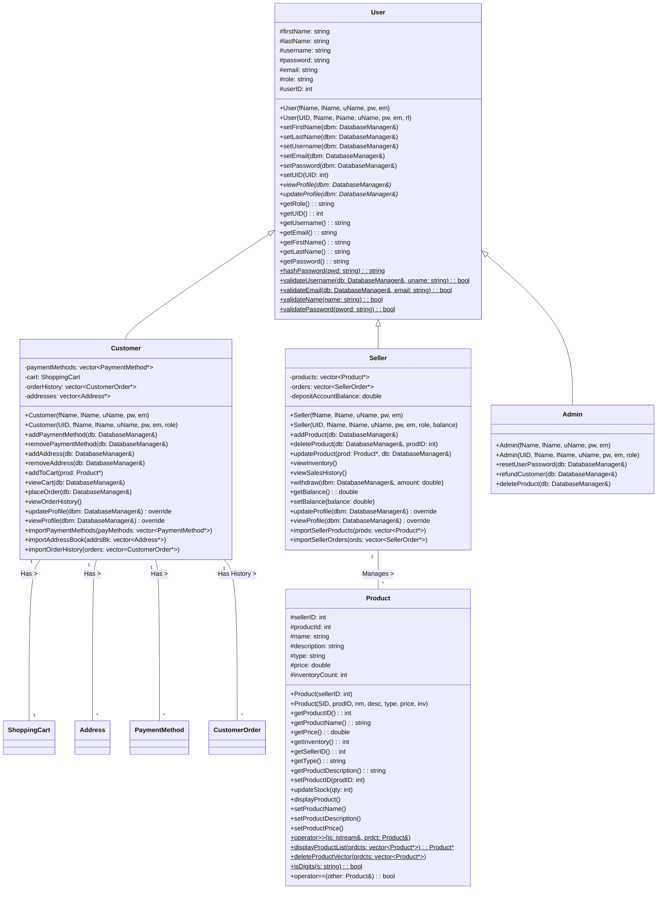
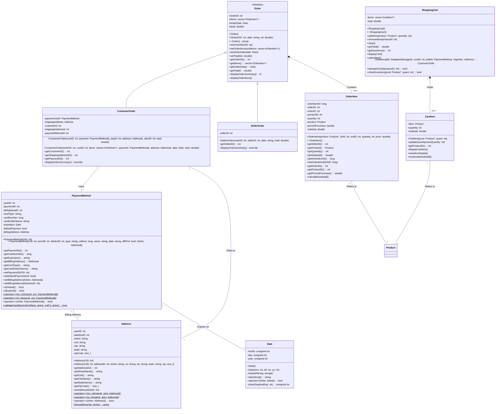
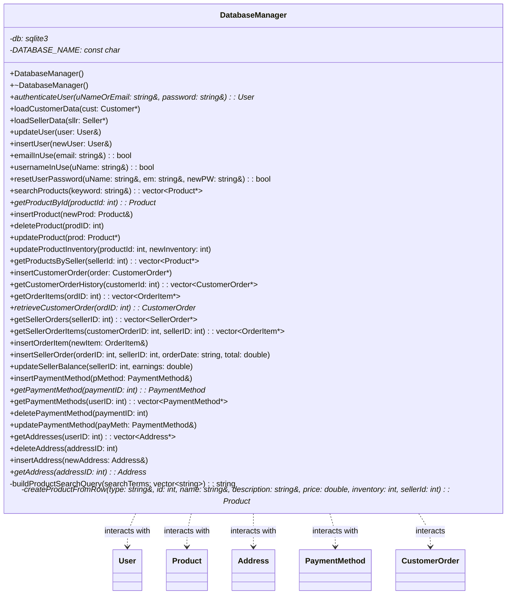

# Scamazon - E-commerce Platform Simulation


Welcome to Scamazon, a command-line based e-commerce platform simulation written in C++. This project demonstrates core functionalities for customers, sellers, and administrators interacting with an online marketplace using a SQLite database for persistence.

## Compilation Instructions

This project uses C++ and relies on the SQLite3 library for database management and the OpenSSL library for password hashing.

For a debian-based system, Mac, or Windows I have included a script to run to install all dependencies and build and execute the program. Debian based systems should run the codespaces script.

1. Make the script executable for debian systems run this command from the project root directory `sudo chmod +x ./buildAndRunCodespaces.sh`.
2. Execute the script; 
   - Debian or Github Codespaces: `./buildAndRunCodespaces.sh`
   - Windows: `./buildAndRunWindows.ps1`
   - Mac: `/.buildAndRunMac.sh`
3. The script will automatically launch the program once it is finished installing dependencies and compiling.

### For other systems

**Prerequisites:**

1.  A C++ compiler supporting C++11 or later (e.g., g++ on Linux/Fedora).
2.  SQLite3 development libraries (e.g., `sudo dnf install sqlite-devel` on Fedora).
3.  OpenSSL development libraries (e.g., `sudo dnf install openssl-devel` on Fedora).

```bash
# Compile all .cpp files and link against SQLite3 and OpenSSL crypto libraries
g++ main.cpp \
    src/Database/DatabaseManager.cpp \
    src/userClasses/User.cpp \
    src/userClasses/Customer.cpp \
    src/userClasses/Seller.cpp \
    src/userClasses/Admin.cpp \
    src/Products/Product.cpp \
    src/UtilityClasses/Address.cpp \
    src/UtilityClasses/CartItem.cpp \
    src/UtilityClasses/Date.cpp \
    src/UtilityClasses/PaymentMethod.cpp \
    src/UtilityClasses/ShoppingCart.cpp \
    src/UtilityClasses/Orders/Order.cpp \
    src/UtilityClasses/Orders/CustomerOrder.cpp \
    src/UtilityClasses/Orders/SellerOrder.cpp \
    src/UtilityClasses/Orders/OrderItem.cpp \
    src/Portals/adminPortal.cpp \
    src/Portals/customerPortal.cpp \
    src/Portals/sellerPortal.cpp \
    -o scamazon_app \
    -I./src \
    -std=c++11 -lsqlite3 -lcrypto
```


This command compiles all necessary .cpp files, specifies the C++11 standard, includes the src directory for header lookup, links the SQLite3 library (-lsqlite3), links the OpenSSL crypto library (-lcrypto), and outputs an executable named scamazon_app. 

## Execution Instructions: Navigate to the directory containing schema.sql (assuming top-level)

The application will display a welcome message and the main menu, prompting you to log in or register. Follow the on-screen prompts. No command-line arguments are required.
## Project Status: 
This project is a mostly complete simulation of an e-commerce platform.
## Features
| Feature | Customer | Seller | Admin |
   |---------|----------|--------|-------|
   | Register/Login | ✅ | ✅ | ❌ |
   | Browse/Add Products | ✅ | ✅ | ❌ |
   | Manage Orders | ✅ | ✅ | ✅ |
   | Refunds | ❌ | ❌ | ✅ |
## Core Functionality:
- User registration (Customer/Seller) and login with password hashing (SHA256 via OpenSSL).
- Customer Portal: Profile view/update, address/payment management, product browsing/searching, shopping cart operations (add, remove, update quantity, view), checkout processing, order history viewing.
- Seller Portal: Profile view/update (including inventory/sales view, withdrawal), product addition/management (update name, description, price, stock).
- Admin Portal: Profile view/update, user password reset, product deletion, customer order item refund (deducts from seller balance).
- Database Persistence: Uses SQLite3 via DatabaseManager class for users, products, addresses, payment methods, and orders (customer_orders, order_items, seller_orders).
## Known Issues / Incomplete Features:
- Refund Logic Discrepancy: The OrderTables.md design document specifies Refunded and RefundDate columns in the order_items table for tracking refunds precisely. However, the provided schema.sql does not include these columns. 
- The current Admin::refundCustomer function only adjusts the seller's balance in the users table and does not mark the specific order_item as refunded in the database. This means refunds aren't persistently tracked per item, and an item could potentially be refunded multiple times without a proper record in the order_items table.
- Error Handling: While some input validation (e.g., for registration, menu choices) exists, error handling for database operations or more complex edge cases could be more robust (e.g., handling failed database connections gracefully after initialization, more specific error messages).
- Concurrency: As a single-user console application, no concurrency control is implemented. Multiple simultaneous operations could lead to data inconsistencies.Product Types: The Product class has a type field, but there's no specific logic or polymorphism based on product type implemented (e.g., different attributes or behaviors for 'Electronics' vs 'Books').
## Manual Introduction

Scamazon is a console-based simulation of an online shopping platform. It allows users to register as Customers or Sellers, or log in as an Administrator, each with a distinct set of capabilities accessed through dedicated text-based portals. The system manages user accounts, product listings, shopping carts, order processing, and basic financial tracking for sellers.
### How to Use
- Launch: Run the compiled executable `./scamazon_app`.
- Main Menu: You'll be presented with options to:
  - Login: Enter your username/email and password. The system authenticates against the database using hashed passwords.
  - Register: Create a new Customer or Seller account. You'll be prompted for first name, last name, a unique username, a unique email, and a password. Password complexity rules (length, character types) are enforced. Username and email uniqueness are checked against the database.
  - Exit: Quit the application.
- Portals: Upon successful login or registration, you will enter the portal corresponding to your user type:
  - Customer Portal: 
    - `View Profile`: Displays your basic info and provides options to view/manage addresses, payment methods, order history, or the cart. 
    - `Update Profile`: Allows changing name, username, email, or password. Also provides access to add/remove addresses and payment methods. 
    - `Browse Products`: Search for products by keyword (searches name and description) or leave blank to browse all. Displays products paginated. You can view details of a specific product and add it to your cart with a specified quantity. Inventory checks are performed. 
    - `View Shopping Cart`: Shows items currently in your cart with quantities and subtotals. Options include: proceeding to checkout, clearing the cart, or selecting an item to update its quantity, remove it, or view its full details. 
    - `View Order History`: Review your past placed orders, including items, totals, dates, payment, and shipping info. 
    - `Logout`: Return to the main menu.
  - Seller Portal: 
    - `View Profile & Manage Store`: Displays your info, current balance, and provides options to view inventory, sales history, or withdraw funds. 
    - `Update Profile`: Modify your basic user information, add/delete products, or withdraw funds. 
    - `Add New Product`: List a new item for sale, providing name, description, type, price, and initial inventory count. The product is added to your listings and the database. 
    - `Logout`: Return to the main menu.
  - Admin Portal: 
    - `View/Update Profile`: Manage your own admin account details (name, username, email, password). 
    - `Reset User Password`: Generate a new random, temporary password for any user (Customer, Seller, or Admin) given their username and email. The new temporary password is displayed.
    - `Refund Customer Order Item`: Process a refund for a specific item within a customer's order. Requires the OrderID and the specific OrderItemID. Note: This currently deducts the item's subtotal from the seller's balance in the database but does not mark the item itself as refunded.
    - `Delete Product`: Permanently remove any product listing from the platform using its ProductID.
    - `Logout`: Return to the main menu.Code DesignThe project is implemented using Object-Oriented Programming (OOP) principles in C++.
## 🔧 Functions to Test

Scamazon offers a wide range of functionality across multiple user roles. Below are recommended features for testing:

1. **Register as a New Customer**  
   Tests the customer account creation flow with input validation.

2. **Add a Payment Method**  
   Exercises user input, credit card validation, and secure handling.

3. **Add an Address**  
   Demonstrates address entry and storage for use during checkout.

4. **Search for Products**  
   Tests the product catalog query system using name or category.

5. **Add to Cart and Place an Order**  
   Covers cart management, payment selection, and order processing.

6. **Register as a New Seller**  
   Allows role-specific registration with seller privileges.

7. **Add a New Product (as Seller)**  
   Adds inventory to the catalog and associates it with the seller.

8. **Log in as Admin** *(credentials provided below)*  
   Access Admin panel with elevated privileges.

9. **Delete a Product (as Admin)**  
   Demonstrates protected operations and product removal logic. Use Product ID 420, should be named `stupid chair`

---

### 🔐 Admin Test Account

**Username:** `admin2`  
**Password:** `adminpassword`

---

> 💡 *These actions together touch over 75% of the system's total functionality.*

## Core Entities: 
**Classes represent key concepts:**
- `User`: Base class for all user types, handling common attributes (name, credentials, ID) and validation logic.
- `Customer`, `Seller`, `Admin`: Derived from User, adding specific attributes (e.g., ShoppingCart, addresses, paymentMethods for Customer; products, orders, depositAccountBalance for Seller) and behaviors relevant to their roles.
- `Product`: Represents items for sale.
- `Address`, `PaymentMethod`, `Date`: Utility classes for storing related information.
- `ShoppingCart`, `CartItem`: Manage the state of a customer's cart before checkout.
- `Order`: Abstract base class for orders.
- `CustomerOrder`, `SellerOrder`: Concrete order types derived from Order.
- `OrderItem`: Represents a line item within an order.
- Persistence: The `DatabaseManager` class acts as a Data Access Layer (DAL), encapsulating all interactions with the SQLite3 database. It uses the C API for SQLite3 to execute SQL queries (based on schema.sql) for creating, reading, updating, and deleting (CRUD) data related to all entities. It handles database connection/disconnection and statement preparation/execution/finalization.
- `User Interface`: Interaction is handled through standard C++ console input/output (iostream). Separate functions (`launchCustomerPortal`, `launchSellerPortal`, `launchAdminPortal`) defined in `adminPortal.cpp`, `customerPortal.cpp`, `sellerPortal.cpp` manage the menu flow and user interaction logic for each portal, calling methods on the respective user objects (`Customer`, `Seller`, `Admin`) and the `DatabaseManager`.
- Security: Password security relies on SHA-256 hashing provided by the OpenSSL library (libcrypto). Input validation checks are implemented for user registration (username/email uniqueness, password complexity, name format) and profile updates.
- Relationships: Classes are interconnected (e.g., `Customer` has `Addresses` and `PaymentMethods`; `Order` contains `OrderItems`; `OrderItem` refers to a `Product`). The `DatabaseManager` handles retrieving and storing these related objects. UML Diagrams Below are UML diagrams for the major classes in the Scamazon project, represented using Mermaid syntax.User Hierarchy and Core Entities



### Order and Utility Classes


### DatabaseManager


